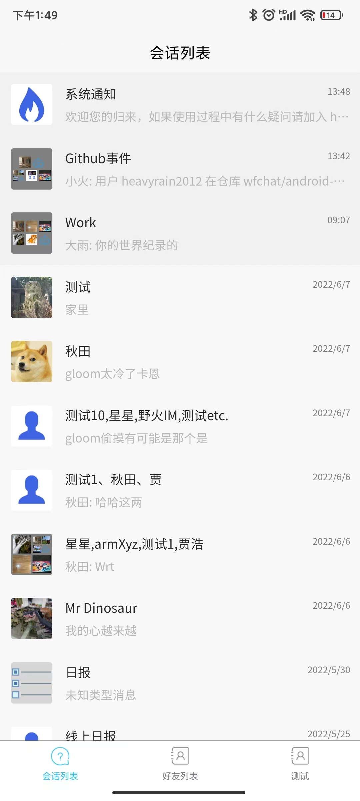
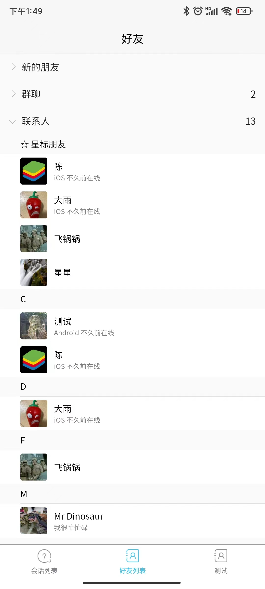
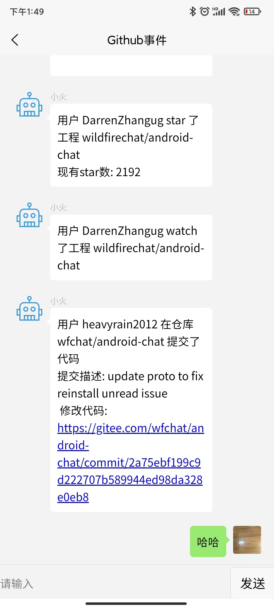
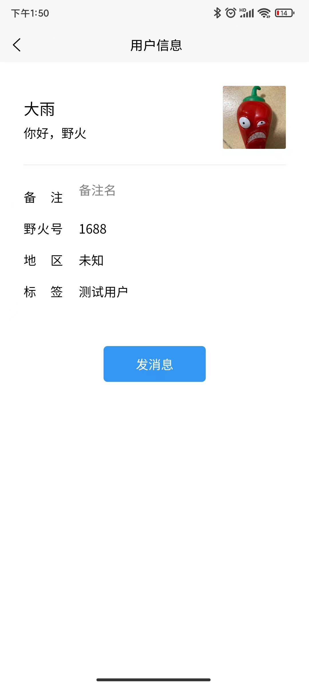

# 野火UniApp平台Demo
支持Android和iOS端，使用了***野火UniApp原生插件***(在UniApp的插件市场搜索“野火IM原生插件”)。

## 关于 uts 的重要说明
1. 本项目使用的是原生语言插件，不支持鸿蒙 5.0，如果需要支持支持鸿蒙 5.0 的话，请使用[uni-chat-uts](https://gitee.com/wfchat/uni-chat-uts)项目
2. 由于[uni-app 官方已不在维护原生语言插件](https://nativesupport.dcloud.net.cn/NativePlugin/)，建议迁移升级[uni-chat-uts](https://gitee.com/wfchat/uni-chat-uts)，该项目使用 uts 插件，支持平滑升级，上层不需要任何改动。

## 关于分支的重要说明
1. `main`：基于`Vue 3`开发，是未来的开发重心
2. `vue2`：基于`Vue 2`开发，进入维护模式，不再开发新功能，鉴于`Vue 2`已经终止支持且不再维护，建议客户升级到`Vue 3`版本

## 关于音视频通话功能的重要说明
野火在uni-chat项目上的音视频实现有2个方案：
1. 方案1： 对应的插件是[野火实时音视频RTC插件(原生UI)](https://ext.dcloud.net.cn/plugin?id=9364), 使用原生UI，就是把Android平台和iOS平台的音视频SDK和UI代码全都集成到uni-chat项目中。这种方案的问题是引入的无关代码太多，且原生UI无法修改，跟uniapp互通也很不方便，不利于二次开发。
2. 方案2：对应的插件是[野火实时音视频RTC插件](https://ext.dcloud.net.cn/plugin?id=15619), 是使用原生的音视频SDK，但UI层使用nvue编写，UI和SDK使用uniapp插件的方式沟通。这种方案引入的SDK比较小，且修改方便，有利于大家做自定义相关 UI。

** 自 2023-11-29 起，uni-chat 将切换到方案 2，方案1 相关的代码，将保留到native-rtc-ui分支 **

## 部署服务端
本应用默认连接野火官方服务，也可以自己部署服务。如果想要私有部署服务，请按照 [服务器快速部署](https://docs.wildfirechat.cn/quick_start/server.html) 来部署服务到您自己的服务器。

## 环境要求
1. node: v18.19.0
2. HBuilder X: 最新版

## 配置
1. 插件市场搜索[野火即时通讯IM插件](https://ext.dcloud.net.cn/plugin?id=7895) 和 [野火实时音视频RTC插件](https://ext.dcloud.net.cn/plugin?id=15619) ，并购买(插件是免费的!)
   > 购买插件时，会将插件和应用/项目绑定，后续通过 HBuilder X 制作自定义调试基座或云打包时，包名要填你在 uniapp 开发者后台配置的对应包名，否则会提示：`包名和插件绑定的不一致，请确认`
2. HBuilderX 原生插件配置，选择云端插件，并选中购买的野火插件
3. 如果使用野火官方服务，直接编译运行即可。如果使用自己私有部署IM服务，需要在[config.js](./config.js)配置应用服务地址和IM服务地址。修改如下配置：
    ```
    // 下面两个配置都要一起修复，否则登录进去之后，会马上退回登录界面
    //应用服务地址
    static APP_SERVER = 'http//wildfirechat.net:8888';

    //IM 服务Host，不能包含 http 前缀或者端口
    static IM_SERVER_HOST = 'wildfirechat.net';
    ```

## 运行
1. 运行```npm install```命令
2. HBuilderX 制作自定义基座，可参考[什么是自定义调试基座及使用说明](https://ask.dcloud.net.cn/article/35115)
3. HBuilderX，运行基座选择：自定义调试基座
4. HBuilderX，运行到 Android App 基座 或 iOS App 基座
> 如果没有制作并运行到自定义基座，那么野火原生插件就没有集成进去，将无法使用野火原生插件，界面会显示白屏。所以一定要严格按照上述步骤执行。

## 移植到其它应用
如果要在现有项目中使用野火原生插件，需要把[wfc](./wfc)目录和[config.js](./config.js)配置文件一同拷贝到现有项目，然后添加***野火UniApp原生插件***。现有项目使用[wfc](./wfc)目录下的[wfc.js](./wfc/client/wfc.js)接口文件。

## 音视频说明
默认附带免费版本音视频，关于野火音视频可以参考[野火音视频使用说明](https://docs.wildfirechat.cn/webrtc/)和[野火音视频简介](https://docs.wildfirechat.cn/blogs/野火音视频简介.html)。
如果使用音视频高级版，请参考[音视频高级版切换方法](./README-AV.MD)。

## 抓取原生插件的日志
1. ```Android```端，可以通过```adb logcat > wfc.log```进行抓去日志，如果提示找不到```adb```命令，请参考 [这儿](https://uniapp.dcloud.net.cn/tutorial/run/run-app-faq.html)
2. ```iOS```端，请连接```Xcode```抓取

## 常见问题说明

1. 如果希望普通电话，能打断音视频通话，则需要在`package.json`里面，添加如下权限声明:
    ```xml
       <uses-permission android:name="android.permission.PROCESS_OUTGOING_CALLS" />
    ```
2. 如何集成推送功能
   1. `HBuilder X`里面选中`manifest.json`，然后选中`Push`-> `uniPush 1.0`
   2. 参考[uni-push v1](https://uniapp.dcloud.net.cn/unipush-v1.html)，并进行相关配置
   3. 编译、配置、部署 [push server](https://github.com/wildfirechat/push_server)
   4. `App.vue` 里面会调用`plus.push.getClientInfoAsync`获取推送相关的`clientId`，可以使用该`clientId`在`uni-push`后台测试推送功能。
   5. 当设备不在线时，`im-server`会调用`push-server`，然后`push-server`调用`个推`进行推送

3. 打包失败：请确认是否执行过```npm install```命令。
4. iPhone上打开会话页面报错`SyntaxError: Invalid regular expression: invalid group specifier name __ERROR`

    `anchorme`只能使用`2.1.2`版本，不支持`3.x`版本，可参数这个[issue](https://github.com/alexcorvi/anchorme.js/issues/133)
5. 制作自定义调试基座或云打包时，提示`包名和插件绑定的不一致，请确认`
 
   原因是购买插件时（插件本身是免费的，但 uniapp 要求走购买流程），绑定的应用/项目的包名和`Hbuilder X`里面，当前配置的不一致，修改一致即可。插件绑定的包名可以通过`manifest.json`文件`nativePlugins`部分的`android_package_name`和`ios_bundle_id`看到

## 应用截图
会话列表


联系人列表


会话界面


用户详情界面

